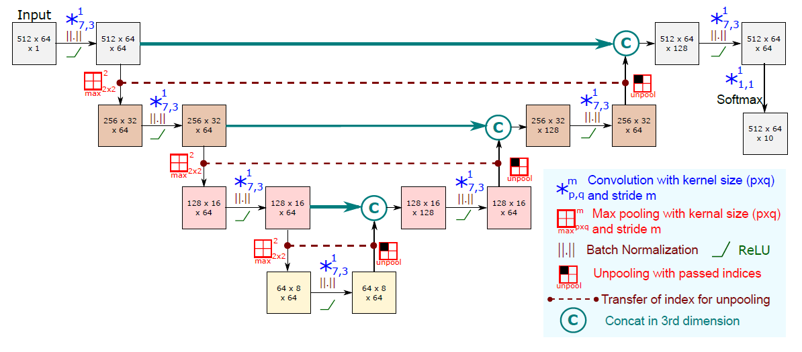
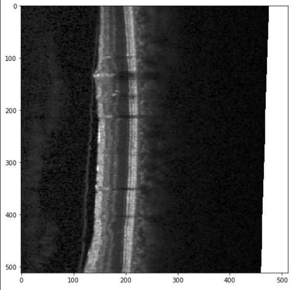
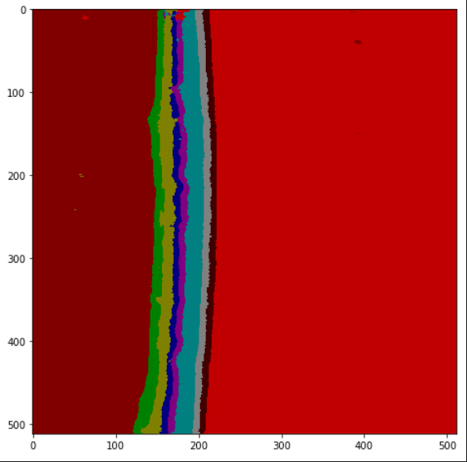

relaynet_pytorch

=======

#### 声明
1. fork from [ai-med](https://github.com/shayansiddiqui),[Shayan Siddiqui's Home Page](https://github.com/shayansiddiqui) 
2. Coded by Abhijit Guha Roy and Shayan Siddiqui 
3. cite: A. Guha Roy, S. Conjeti, S.P.K.Karri, D.Sheet, A.Katouzian, C.Wachinger, and N.Navab, "ReLayNet: retinal layer and fluid segmentation of macular optical coherence tomography using fully convolutional networks," Biomed. Opt. Express 8, 3627-3642 (2017)  
4. [Paper Link](https://arxiv.org/abs/1704.02161). 
5. 其他分支:[Atomwh](https://github.com/Atomwh/relaynet_pytorch),[simasima121](https://github.com/simasima121/relaynet_pytorch). 
#### Model

#### 数据
1. 数据集下载链接:[Duke University](http://people.duke.edu/~sf59/Chiu_BOE_2014_dataset.htm)
2. 数据集说明:
   1. 共十个病人,每人有十一张被标记.中央凹上的一张被标记,中央凹两侧各5张,共有110张被标记. 
   2. 图片大小[496, 768],但是分层标记只存在于118:653区间,长度是535. 
   3. 分层标记大小是[8,768],每个768中118:653区间存储一个代表纵坐标的数字,代表分层线的位置. 
   4. Fluid标签是与图片等大的掩码. 
4. 网络输入数据说明:
   1. 输入数据大小为[512,64]. 
   2. 每一个数据实例包括:原始图片,语义分割标签图,权重图(意义见论文3.3.2和图4). 
   3. 图片,标签和语义都是单通道的. 

#### 效果

  

